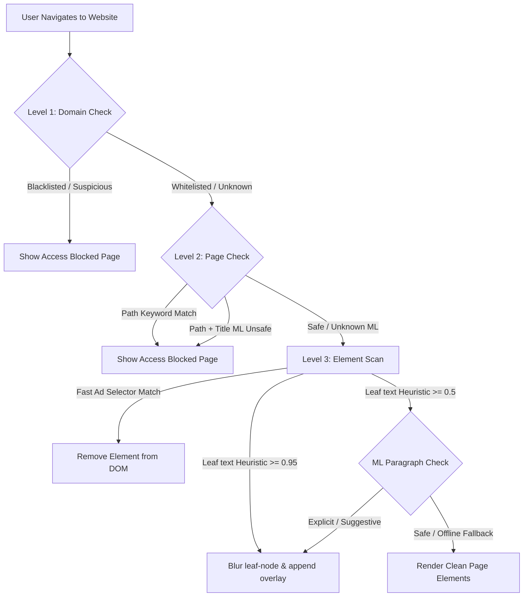

# 🛡️ Advanced Web Filter — Advanced Three-Level Web Content Filter

An advanced, hybrid web content filter built as a **Chrome Extension (Manifest V3)** backed by a **Local Flask Machine Learning Server**. The project integrates traditional rule-based blacklisting with CPU-friendly semantic classifiers to secure browsing environments.

---

## 📖 Table of Contents
1. [Key Features](#-key-features)
2. [System Architecture](#-system-architecture)
3. [Repository Structure](#-repository-structure)
4. [Installation & Setup](#%EF%B8%8F-installation--setup)
   - [1. Backend & ML Environment Setup](#1-backend--ml-environment-setup)
   - [2. Model Training](#2-model-training)
   - [3. Run the ML API Server](#3-run-the-ml-api-server)
   - [4. Install the Chrome Extension](#4-install-the-chrome-extension)
5. [Running Tests](#-running-tests)
6. [Tech Stack](#%EF%B8%8F-tech-stack)

---

## 🌟 Key Features

The extension enforces a strict, sequential **three-level content filtering pipeline** designed to keep layouts intact while ensuring safe browsing:

*   **Level 1: Website/Domain Filter (Website Scope)**
    *   **Allowed Sites (Whitelist)**: Instantly permits trusted sites (e.g. Wikipedia) and bypasses aggressive domain blocking.
    *   **Blocked Sites (Blacklist)**: Instantly blocks known malicious hostnames.
    *   **Domain Heuristics**: Automatically blocks unclassified hostnames matching adult terms.
    *   **User Configurable**: Whitelists and Blacklists are persistent and fully editable via the Extension Popup UI.
*   **Level 2: Webpage/URL Filter (Page Scope)**
    *   **Path Keywords**: Inspects URL path parameters at `document_start` to abort early if explicit keywords are matched.
    *   **ML Page Intent Classification**: Connects to the local Flask API. Extracts webpage paths and document titles to verify user intent using a trained Logistic Regression pipeline. Good pages within allowed websites remain open; bad pages are replaced by a clean, themed block card.
*   **Level 3: Element/Paragraph Filter (Element Scope)**
    *   **Network-Level Block Engine**: Integrates Chrome's `declarativeNetRequest` API to intercept and block ads, trackers, analytics, error loggers, and popup networks at the network layer before download.
    *   **Rule-based Cleaners**: Sanitizes popups, iframes, advertising banners, and explicit links on load.
    *   **Non-Destructive Leaf Blurring**: Scrapes text paragraphs (`p`, `li`, `blockquote`, leaf `div` tags) and applies a local suspicious text heuristic.
    *   **ML Paragraph Semantic Classifier**: Flags suggestive or explicit blocks and wraps them in a beautiful visual blur with a "Content Hidden" overlay, leaving the rest of the webpage structure and layout completely unaffected.
    *   **SPA Support**: Includes a throttled `MutationObserver` to watch and filter elements dynamically injected on single-page applications.

---

## 📐 System Architecture

The following diagram illustrates how web requests pass sequentially from Level 1 checks through to Level 3 DOM modifications:



---

## 📁 Repository Structure

```
Advanced-Web-Filter/
├── .gitignore              # Configured to ignore python venvs, caches, and binary .pkl models
├── requirements.txt        # Pinned project dependencies
├── README.md               # Extensive project documentation
├── backend/
│   ├── __init__.py         # Python package initialization
│   └── local_ml_server.py  # Flask server serving classification endpoints
├── ml/
│   ├── models/             # Directory where trained ML models are saved (.pkl format)
│   ├── train_page_model.py # Webpage intent model training script
│   └── train_paragraph_model.py # Paragraph semantic model training script
├── data/
│   ├── page_sample_for_training.csv       # Training CSV for Level 2 classifier
│   └── paragraph_sample_for_training.csv  # Training CSV for Level 3 classifier
├── extension/
│   ├── manifest.json       # Chrome extension settings (Manifest V3)
│   ├── background.js       # Extension Service Worker (ML Request Broker)
│   ├── content.js          # Main content script enforcing Level 1, 2, 3 checks
│   ├── popup.html          # Option management popup (Tabbed UI)
│   ├── popup.js            # Option management UI actions
│   └── blocked.html        # Fallback static block page
└── tests/
    └── test_server.py      # Unit test suite verifying server endpoints
```

---

## 🛠️ Installation & Setup

### 1. Backend & ML Environment Setup

The backend requires **Python 3.10+**. Clone the repository and navigate to the project directory:

```bash
# 1. Create a local virtual environment
python -m venv .venv

# 2. Activate the virtual environment
# On Windows (PowerShell):
.venv\Scripts\Activate.ps1
# On Linux/macOS:
source .venv/bin/activate

# 3. Install required packages
pip install -r requirements.txt
```

### 2. Model Training

Before launching the server, you need to train and save the machine learning classification models. We use absolute path routing in training scripts so they can be run from the root:

```bash
# Train the webpage intent classifier (Level 2)
python ml/train_page_model.py

# Train the paragraph semantic classifier (Level 3)
python ml/train_paragraph_model.py
```
This generates and outputs the trained pipeline binaries `page_model.pkl` and `paragraph_model.pkl` in the `ml/models/` folder.

### 3. Run the ML API Server

Run the Flask server locally:

```bash
python backend/local_ml_server.py
```
The server will start on `http://127.0.0.1:5000`. You can visit `http://127.0.0.1:5000/health` in your browser to verify that it is running and has successfully loaded both models.

### 4. Install the Chrome Extension

1.  Open Google Chrome and navigate to `chrome://extensions/`.
2.  Enable **Developer mode** (toggle in the top-right corner).
3.  Click **Load unpacked** in the top-left corner.
4.  Select the `extension` folder inside this repository.
5.  Click the extension icon in your toolbar, access options, verify the **ML Server Connection Status** is showing as **Online**, and begin browsing safely.

---

## 🧪 Running Tests

The test suite exercises the backend routes and confirms Flask handles input arguments (URLs, titles, and paragraphs) correctly:

```bash
# From the root directory, run:
.venv\Scripts\python -m unittest tests/test_server.py
```

---

## 🛠️ Tech Stack

*   **Browser Extension**: JavaScript (Manifest V3), HTML5, Vanilla CSS3 (curated dark-mode and glassmorphic layouts).
*   **Backend Server**: Python, Flask, Joblib (for fast model serialization).
*   **Machine Learning**: Scikit-Learn (TF-IDF Vectorizers + Logistic Regression classifiers), Pandas, NumPy.
